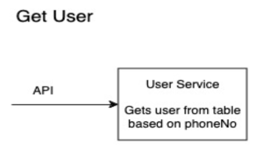
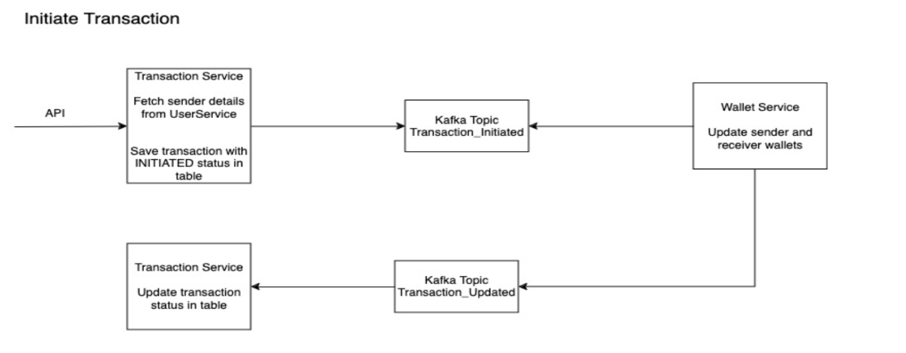
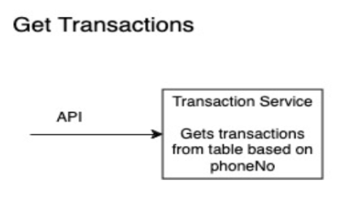

# EzyPay - A Microservices-based Wallet Application

[](https://www.java.com)
[](https://spring.io/projects/spring-boot)
[](https://kafka.apache.org/)
[](https://www.mysql.com/)
[](https://gradle.org/)
[](https://opensource.org/licenses/MIT)

EzyPay is a simple, peer-to-peer digital wallet system built using a modern, event-driven microservices architecture. It demonstrates how to build a resilient and scalable system using Java, Spring Boot, and Apache Kafka.

## Table of Contents
- [Features](#features)
- [System Architecture & Flow Diagrams](#system-architecture--flow-diagrams)
    - [Services](#services)
    - [Key Workflows](#key-workflows)
- [Tech Stack](#tech-stack)
- [Prerequisites](#prerequisites)
- [Getting Started](#getting-started)
    - [1. Clone the Repository](#1-clone-the-repository)
    - [2. Setup Dependencies (MySQL & Kafka)](#2-setup-dependencies-mysql--kafka)
    - [3. Configure Services](#3-configure-services)
    - [4. Build and Run](#4-build-and-run)
- [API Endpoints](#api-endpoints)
- [Security](#security)

## Features
- **User Onboarding**: Securely register new users.
- **Wallet Creation**: Automatically create a wallet with a signup bonus for new users.
- **P2P Transactions**: Seamlessly send money from one user to another.
- **Transaction History**: View a list of all past transactions.
- **Email Notifications**: Notify users upon successful registration.
- **Asynchronous Processing**: Leverages Kafka for non-blocking, event-driven operations.

## System Architecture & Flow Diagrams
The application is designed as a set of loosely coupled microservices that communicate asynchronously via a Kafka message broker. This design ensures high availability and scalability.

### Services
- **User Service**: Manages user-related data, including creation, retrieval, and authentication.
- **Wallet Service**: Manages the user's wallet, including balance updates and creation.
- **Transaction Service**: Handles the logic for initiating and tracking the status of transactions.
- **Notification Service**: Responsible for sending notifications to users (e.g., via email).

### Key Workflows

#### 1. Create User Flow
This flow is triggered when a new user signs up. The process is asynchronous to ensure a fast API response. It involves creating the user, their wallet, and sending a welcome notification.


#### 2. Get User Flow
A simple synchronous flow where the API requests user details from the User Service based on their phone number.



#### 3. Initiate Transaction Flow
This flow demonstrates a distributed transaction managed using Kafka events. It ensures that the transaction is processed reliably without blocking the initial API call.



#### 4. Get Transactions Flow
A synchronous flow to retrieve the transaction history for a specific user from the Transaction Service.



## Tech Stack
- **Framework**: [Spring Boot](https://spring.io/projects/spring-boot)
- **Language**: [Java 17](https://www.oracle.com/java/technologies/javase/jdk17-archive-downloads.html)
- **Database**: [MySQL](https://www.mysql.com/)
- **Message Broker**: [Apache Kafka](https://kafka.apache.org/)
- **Build Tool**: [Gradle](https://gradle.org/)
- **Security**: [Spring Security](https://spring.io/projects/spring-security)
- **Notifications**: [Spring Mail](https://docs.spring.io/spring-framework/docs/current/reference/html/integration.html#mail)

## Prerequisites
- JDK 17 or later
- Gradle 7.x
- Docker and Docker Compose (Recommended for running dependencies)
- An IDE (like IntelliJ IDEA or VSCode)

## Getting Started

### 1. Clone the Repository
```bash
git clone https://github.com/your-username/ezypay.git
cd ezypay
```

### 2. Setup Dependencies (MySQL & Kafka)
The easiest way to run the required MySQL and Kafka instances is with Docker Compose. Create a `docker-compose.yml` file in the root of the project:

```yaml
version: '3.8'
services:
  mysql:
    image: mysql:8.0
    container_name: ezypay-mysql
    restart: always
    environment:
      MYSQL_ROOT_PASSWORD: rootpassword
      MYSQL_DATABASE: ezypay_users,ezypay_wallets,ezypay_txns
    ports:
      - "3306:3306"

  zookeeper:
    image: confluentinc/cp-zookeeper:7.0.1
    container_name: ezypay-zookeeper
    environment:
      ZOOKEEPER_CLIENT_PORT: 2181
      ZOOKEEPER_TICK_TIME: 2000

  kafka:
    image: confluentinc/cp-kafka:7.0.1
    container_name: ezypay-kafka
    depends_on:
      - zookeeper
    ports:
      - "9092:9092"
    environment:
      KAFKA_BROKER_ID: 1
      KAFKA_ZOOKEEPER_CONNECT: 'zookeeper:2181'
      KAFKA_LISTENER_SECURITY_PROTOCOL_MAP: PLAINTEXT:PLAINTEXT,PLAINTEXT_INTERNAL:PLAINTEXT
      KAFKA_ADVERTISED_LISTENERS: PLAINTEXT://localhost:9092,PLAINTEXT_INTERNAL://kafka:29092
      KAFKA_OFFSETS_TOPIC_REPLICATION_FACTOR: 1
      KAFKA_TRANSACTION_STATE_LOG_MIN_ISR: 1
      KAFKA_TRANSACTION_STATE_LOG_REPLICATION_FACTOR: 1
```

Run Docker Compose to start the containers:
```bash
docker-compose up -d
```
You will need to manually create the databases in MySQL: `ezypay_users`, `ezypay_wallets`, and `ezypay_txns`.

### 3. Configure Services
Each microservice (`user-service`, `wallet-service`, etc.) will have its own `application.properties` or `application.yml` file. Update the datasource and Kafka configurations as needed.

**Example `application.properties` for a service:**
```properties
# Server Port
server.port=8081 # Use a different port for each service

# Spring Datasource
spring.datasource.url=jdbc:mysql://localhost:3306/ezypay_users?createDatabaseIfNotExist=true
spring.datasource.username=root
spring.datasource.password=rootpassword
spring.jpa.hibernate.ddl-auto=update

# Kafka Properties
spring.kafka.bootstrap-servers=localhost:9092
spring.kafka.consumer.group-id=my-group-id

# Spring Mail (for Notification Service)
spring.mail.host=smtp.gmail.com
spring.mail.port=587
spring.mail.username=your-email@gmail.com
spring.mail.password=your-app-password
spring.mail.properties.mail.smtp.auth=true
spring.mail.properties.mail.smtp.starttls.enable=true
```

### 4. Build and Run
Use Gradle to build all the microservice projects.
```bash
# From the root directory
./gradlew clean build
```

Then, run each service. You can run them from your IDE or via the command line:
```bash
java -jar user-service/build/libs/user-service-0.0.1-SNAPSHOT.jar
java -jar wallet-service/build/libs/wallet-service-0.0.1-SNAPSHOT.jar
java -jar transaction-service/build/libs/transaction-service-0.0.1-SNAPSHOT.jar
java -jar notification-service/build/libs/notification-service-0.0.1-SNAPSHOT.jar
```

## API Endpoints

### User Service
*   `POST /api/users` - Create a new user.
    ```json
    // Request Body
    {
        "name": "John Doe",
        "phoneNo": "9876543210",
        "email": "john.doe@example.com",
        "password": "strongpassword"
    }
    ```
*   `GET /api/users/{phoneNo}` - Get user details by phone number.

### Transaction Service
*   `POST /api/transactions` - Initiate a new transaction.
    ```json
    // Request Body
    {
        "senderPhoneNo": "9876543210",
        "receiverPhoneNo": "1234567890",
        "amount": 50.00,
        "purpose": "Lunch"
    }
    ```
*   `GET /api/transactions/{phoneNo}` - Get all transactions for a user.

## Security
Endpoints are protected using **Spring Security**. This framework provides a highly customizable way to handle authentication and authorization. In this project, it is used to secure the API endpoints, preventing unauthenticated access. You can configure it to use various mechanisms such as Basic Authentication or form-based login depending on the project's needs.

---

Developed with ❤️ by Nishant Rathore.